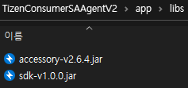
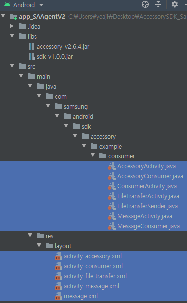
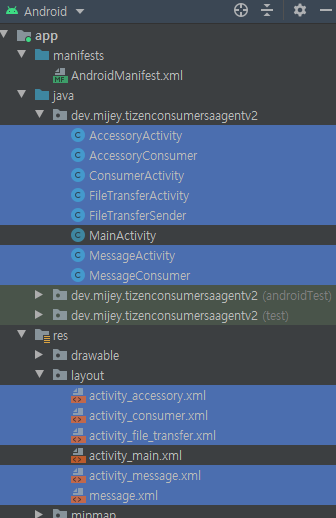
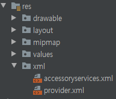
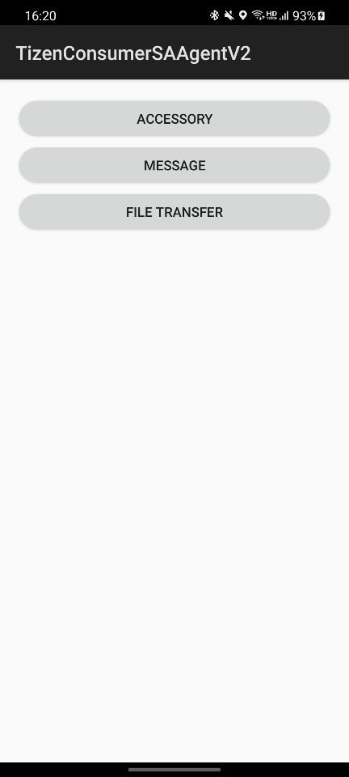
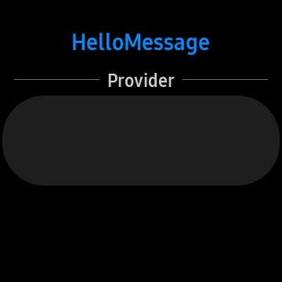
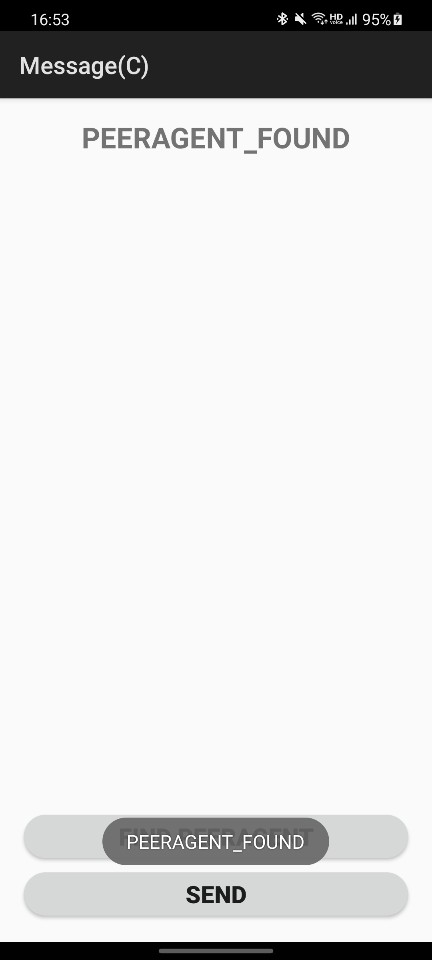
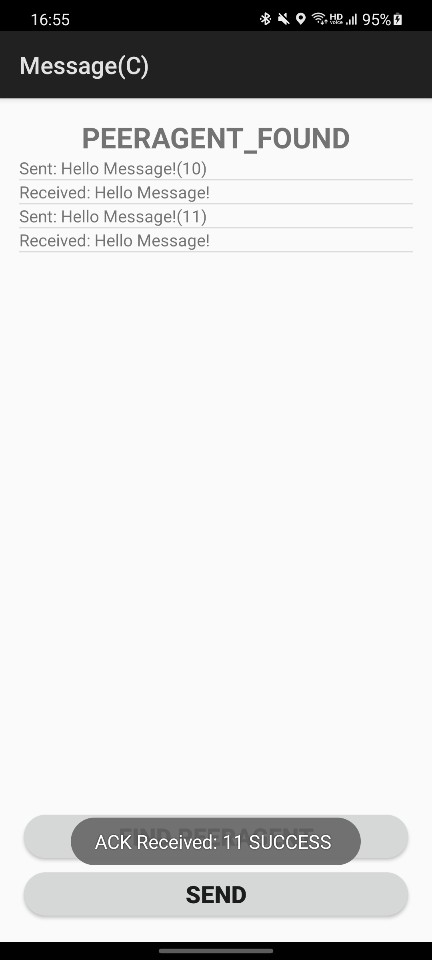
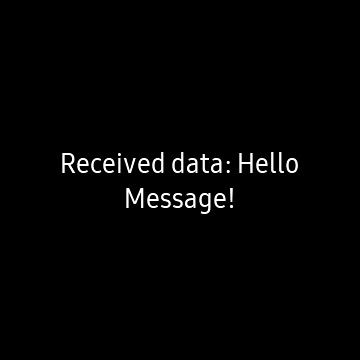

# Samsung Accessory SDK version 2.6.4<br>Consumer(Android) SSAgentV2<br>Sample App Migration


갤럭시 워치 앱을 개발하려고 https://developer.samsung.com/galaxy-accessory/download.html 에서 공식 SDK 샘플을 받았는데 버전 문제로 실행이 안되었다. 내 개발환경에 맞춰서 Consumer(Android) app_SAAgentV2 샘플 앱을 마이그레이션 했던 과정과 결과물을 공유해본다.

## 개발 환경

- Android Studio 4.1.1
  - Android 11(SDK 30)을 개발할 수 있는 환경이 세팅되어 있었음
  - 이 프로젝트의 **SDK target은 29**임
- Tizen Studio 4.1
  - 워치에 Hello world를 띄울 수 있는 빌드 및 테스트 환경 세팅(무선 디버깅, Certificate 등)은 되어 있었음
  - Web 샘플 실행을 위해 `SDK 3.0 Wearable` 설치 필요
  - Native 샘플 실행을 위해 `SDK 2.3.2 Wearable` 설치 필요
- 테스트 디바이스
  - Galaxy S20 5G(SM-G981N)
  - Galaxy Watch Active2(SM-R830)

## 준비사항

1. https://developer.samsung.com/galaxy-accessory/download.html 에서 `Accessory SDK version 2.6.4` 다운로드 후 압축 풀기
2. `Samples` 폴더에 있는 `Samples(Native).zip`과 `Samples(Web).zip`도 압축 해제

`Consumer(Android)`에서 Android O 버전을 대응하는 `app_SAAgentV2` 샘플을 마이그레이션 할거임

`Provider(Tizen)`에 있는 타이젠 샘플은 수정 없이 그대로 사용

## Consumer(Android) 마이그레이션

### 1. 프로젝트 준비

- `File - New - New Project`에서 `Empty Acitivity`로 평범한 안드로이드 프로젝트 생성
- `File - Open`에서 `AccessorySDK_v2.6.4\Samples\Samples(Native)\Consumer(Android)_Provider(Tizen)\Consumer\app_SAAgentV2` 프로젝트 열기
- 이제부터 `app_SAAgentV2` 샘플을 새로 만든 안드로이드 프로젝트 `TizenConsumerSAAgentV2`로 옮길 것임

### 2. 라이브러리(jar) 복사

`accessory-v2.6.4.jar`와 `sdk-v1.0.0.jar`를 새로 만든 프로젝트의 `app\libs`에 복사

- `jar` 파일은 `AccessorySDK_v2.6.4\Libs` 폴더나 `app_SAAgentV2\libs`에 있음



`build.gradle`에서 `dependencies` 추가

```
dependencies {
    implementation files('libs/accessory-v2.6.4.jar')
    implementation files('libs/sdk-v1.0.0.jar')

    ...
}
```

### 3. 리소스 파일 복사

- `dimens.xml`, `string.xml` 복사

```xml
<!-- res/values/dimens.xml -->
<?xml version="1.0" encoding="utf-8"?>
<resources>
    <dimen name="activity_horizontal_margin">16dp</dimen>
    <dimen name="activity_vertical_margin">16dp</dimen>
</resources>
```

```xml
<!-- res/values/strings.xml -->
<resources>
    <!-- app_name 빼고 전부 복사 -->
    <string name="app_name">TizenConsumerSAAgentV2</string>

    <string name="action_settings">Settings</string>
    <string name="hello_world">Hello Accessory!</string>
    <string name="ConnectionEstablishedMsg">Service Connection with AccessoryProvider has been established.</string>
    <string name="ConnectionTerminateddMsg">Service Connection with AccessoryProvider has been terminated.</string>
    <string name="ConnectionAlreadyExist">Service Connection with AccessoryProvider has already been existed!!!</string>
    <string name="ConnectionAlreadyDisconnected">Service Connection with AccessoryProvider has already been disconnected!!!</string>
    <string name="ConnectionFailure">Service Connection with AccessoryProvider Failure</string>
    <string name="NoPeersFound">No peers have been found!!!</string>
    <string name="ConnectionEstablishedMsg2">Service Connection with MessageProvider has been established.</string>
    <string name="ConnectionTerminateddMsg2">Service Connection with MessageProvider has been terminated.</string>
    <string name="ConnectionAlreadyExist2">Service Connection with MessageProvider has already been existed!!!</string>
    <string name="ConnectionAlreadyDisconnected2">Service Connection with MessageProvider has already been disconnected!!!</string>
    <string name="ConnectionFailure2">Service Connection with MessageProvider Failure</string>
    <string name="NoPeersFound2">No peers have been found!!!</string>
    <string name="buttonConnect">Connect</string>
    <string name="buttonDisconnect">Disconnect</string>
    <string name="buttonFindPeerAgent">Find PeerAgent</string>
    <string name="buttonSend">Send</string>

    <string name="send">Send</string>
    <string name="seek_and_connect">Seek and Connect</string>
    <string name="cancel">Cancel</string>
    <string name="cancelAll">Cancel All</string>

    <string name="title_activity_accessory">Accessory(C)</string>
    <string name="title_activity_message">Message(C)</string>
    <string name="title_activity_file_transfer">File Transfer(C)</string>
</resources>
```

### 4. Java 파일, layout 파일 복사

<center>
    
    
</center>

- Java 파일과 layout 파일을 각각 맞는 위치에 Ctrl+C, Ctrl+V 로 붙여넣으면 안드로이드 스튜디오가 패키지 경로 같은건 알아서 바꿔줌
- `MainActivity`와 `activity_main.xml`은 삭제해도 무방

### 5. 코드 수정

- layout 파일
  - `tools:context` 패키지 경로 수정
    - ex) `tools:context="com.samsung.android.sdk.accessory.example.consumer.AccessoryActivity"` -> `tools:context=".AccessoryActivity"`
  - (안해도됨) `RelativeLayout`을 모두 `LinearLayout`으로 바꿈
- Java 파일
  - Gradle Sync 후 컴파일 에러가 있는지 확인
  - (안해도됨) 안쓰는 import 지우고 코드 정리

### 6. accessoryservices.xml

- `res/xml` 폴더를 통째로 복사
- `accessoryservices.xml` 안에 있는 `serviceImpl`의 패키지 경로를 모두 새로운 프로젝트의 패키지 경로로 수정(총 3개)
  - ex) `serviceImpl="com.samsung.android.sdk.accessory.example.consumer.AccessoryConsumer"` -> `serviceImpl="dev.mijey.tizenconsumersaagentv2.AccessoryConsumer"`
- `res/xml` 폴더에 `provider.xml` 파일을 생성하고 `accessoryservices.xml` 안에 있는 `paths` 태그를 잘라내서 붙임
- (참고) 타이젠 앱에서 인식하는 앱 네임은 `accessoryservices.xml` 안에 있는 `<application name="HelloAccessoryConsumer">` 이 부분임

<center>
    
</center>

### 7. Manifest.xml

1. 패키지 경로만 유지하고 전체 복붙
2. `android:name="android.support.v4.content.FileProvider"`를 `android:name="androidx.core.content.FileProvider"`로 수정
3. provider authorities 패키지 경로 수정
   - ex) `android:authorities="com.samsung.android.sdk.accessory.example.consumer"` -> `android:authorities="dev.mijey.tizenconsumersaagentv2"`
4. meta-dat 태그 안에 있는 `android:resource="@xml/accessoryservices"`를 아까 만든 `android:resource="@xml/provider"`로 수정

### 8. targetSdkVersion

- Manifest에 queries 태그를 넣으면 SDK 30에서도 잘 돌아간다는 글이 있었으나 Logcat에 무수한 에러만 내뿜으며 제대로 동작하지 않음
  - https://forum.developer.samsung.com/t/sdk-initialization-failed-accessory-framework-not-installed/1771/10
- 그래서 queries 태그는 주석 처리하고 **targetSdkVersion을 29**로 낮춤

### 9. 빌드 및 실행

컴파일이 잘 되더라도 어딘가 패키지 네임이 안맞으면 제대로 동작하지 않는다. `ctrl + shift + F` 전체검색으로 `example`을 검색(만약 이 프로젝트를 복붙했다면 `mijey`를 검색)해서 **패키지명이 안맞는 경우가 없는지** 찾아보는 것을 권한다.

## Provider(Tizen) 실행

### Native 앱 실행

- 타이젠 스튜디오에서 `AccessorySDK_v2.6.4\Samples\Samples(Native)\Consumer(Android)_Provider(Tizen)\Provider\HelloMessage` 프로젝트를 열어서 실행

### Web 앱 실행

- 타이젠 스튜디오에서 `C:\Users\yeaji\Downloads\AccessorySDK_v2.6.4\Samples\Samples(Web)\Basic(App)\Consumer(Android)_Provider(Tizen)\Provider\HelloMessage` 프로젝트를 열어서 실행

### 워치와 폰이 잘 연동되는지 확인

1. 워치와 폰에서 각각 앱을 실행

<center>
    
    
</center>

2. 폰에서 `MessageActivity` 실행
3. `FIND PEERAGENT`가 잘 되는지 확인

<center>
    
</center>

4. `SEND`가 잘 되는지 확인

<center>
    
    
</center>
